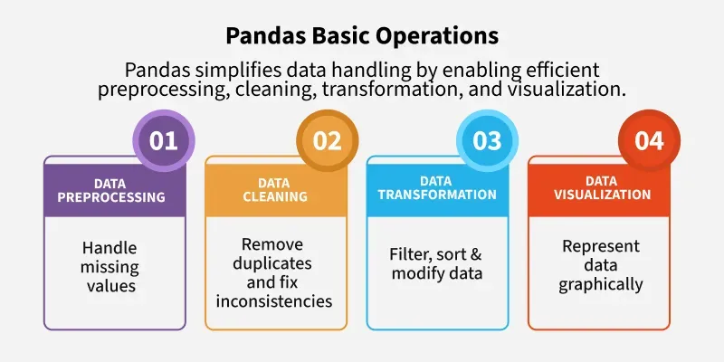

<h1>PANDAS</h1>

* Pandas (stands for Python Data Analysis) is an open-source software library designed for data manipulation and analysis.

* Tools for working with time series data, including date range generation and frequency conversion. For example, we can convert date or time columns into pandas’ datetime type using pd.to_datetime(), or specify parse_dates=True during CSV loading.

