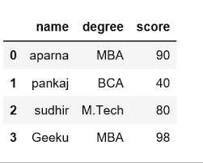
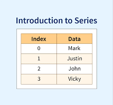

<h1 style="text-align: center;">PANDAS</h1>

* Pandas (stands for Python Data Analysis) is an open-source software library designed for data manipulation and analysis.

* Tools for working with time series data, including date range generation and frequency conversion. For example, we can convert date or time columns into pandas’ datetime type using pd.to_datetime(), or specify parse_dates=True during CSV loading.

* Seamlessly integrates with other Python libraries like NumPy, Matplotlib, and scikit-learn.

<h2>Creating a Pandas DataFrame</h2>

*  Pandas DataFrame comes is a powerful tool that allows us to store and manipulate data in a structured way, similar to an Excel spreadsheet or a SQL table. A DataFrame is similar to a table with rows and columns. It helps in handling large amounts of data, performing calculations, filtering information with ease.

* Above image is  a sample dataframe you can create your own dataframe by adding your own data in the list

## We created our own dataframe (pandas.ipynb) file 

* In that dataframe Each item in the list becomes a row
* The DataFrame consists of a single unnamed column.

## Creating a DataFrame from a List of Dictionaries
* We can also create dataframe using List of Dictionaries. It represents data where each dictionary corresponds to a row. This method is useful for handling structured data from APIs or JSON files. It is commonly used in web scraping and API data processing since JSON responses often contain lists of dictionaries.

<h1>Python Pandas Series</h2>

* Python Pandas Series is as same as Excel spreadsheet or a database table.
* Pandas Series is a one-dimensional labeled array that can hold like data of any type (integer, float, string, Python objects........

